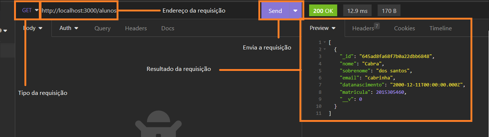

# App Food
## Preparação do ambiente de desenvolvimento

### Requisitos

Node - https://nodejs.org/en

Docker - https://www.docker.com/

Insomnia (Opcional) - https://insomnia.rest/download

### Rodando projeto

Para instalar as dependencias do projeto use o comando:

npm start

O banco mongo precisar ser rodado em  um container docker, para rodar o banco use o comando:

docker run --rm -d -p 27017:27017 mongo

Esse comando vai repassar tudo que cair na porta 27017 do computador para a porta 27017 do container

E por fim para rodar a aplicação use o comando:

npm run dev

A aplicação vai rodar na porta 3000 por padrão

### Testando a aplicação

Para testar o servidor vamos usar o insomnia, você pode usar outra aplicação que envie requições http ou uma aplicação real, para o teste temos a seguinte rota que trabalha com uma tabela de alunos no mongo:

http://localhost:3000/alunos GET/POST

Abra o insomnia 

